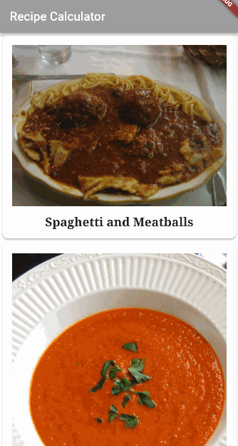

# Flutter Apprentice Apps

A collection of apps created while studying the [Flutter Apprentice Book](https://www.raywenderlich.com/books/flutter-apprentice) by [Raw Wenderlick](https://www.raywenderlich.com).

## The apps

- [Recipes app](./recipes): Lists recipes and let the user calculate how much they will need of each ingredient to make a given number of servings. 

- [Fooderlich app](./fooderlich): Displays cards simulating a Recipes Social App. 

