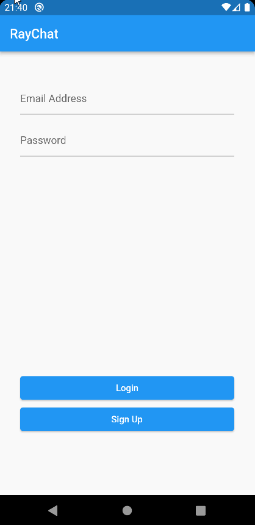

# Flutter Apprentice Apps

A collection of apps created while studying the [Flutter Apprentice Book](https://www.raywenderlich.com/books/flutter-apprentice) by [Raw Wenderlick](https://www.raywenderlich.com).

## The apps

- [Recipes app](./recipes): Lists recipes and let the user calculate how much they will need of each ingredient to make a given number of servings. 

- [Fooderlich app](./fooderlich_4): Displays cards simulating a Recipes Social App, and allows the user to create a grocery buying list. 

Note: This app was remade 4 times during the book, this is the final version (Version 4), check the previous versions:
- [Version 1](./fooderlich)
- [Version 2](./fooderlich_2)
- [Version 3](./fooderlich_3)

- [Recipe Finder app](./bookmarks): Lets the user search for recipes, bookmark them and list what ingredient they need to do the recipes saved. 

- [RayChat app](./raychat): User chat app 

